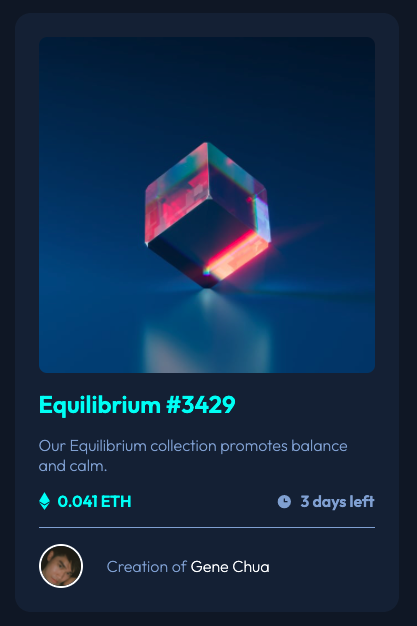
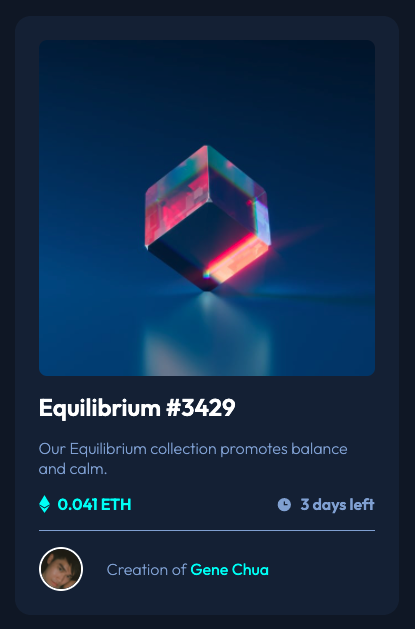

# Frontend Mentor - NFT preview card component solution

This is a solution to the [NFT preview card component challenge on Frontend Mentor](https://www.frontendmentor.io/challenges/nft-preview-card-component-SbdUL_w0U). Frontend Mentor challenges help you improve your coding skills by building realistic projects.

## Table of contents

- [Overview](#overview)
  - [The challenge](#the-challenge)
  - [Screenshot](#screenshot)
  - [Links](#links)
- [My process](#my-process)
  - [Built with](#built-with)
  - [What I learned](#what-i-learned)
  - [Continued development](#continued-development)
  - [Useful resources](#useful-resources)
- [Author](#author)

## Overview

### The challenge

Users should be able to:

- View the optimal layout depending on their device's screen size
- See hover states for interactive elements

### Screenshots

#### Desktop


#### Desktop Active States

Various CSS elements turn cyan upon hover





### Links

- Github Repo URL: [Github Repo](https://github.com/iamgenechua/NFT-preview-card-component.git)

## My process

### Built with

- Semantic HTML5 markup
- Flexbox
- CSS Grid
- Mobile-first workflow
- Media Queries
- CSS pseudo-elements

### What I learned

1. I was more comfortable with using CSS Grid to design the layout of the components
2. I learnt that `` will by default leave a 2px gap underneath it. To remove that gap, change the display to block

```css
img {
  display: block;
}
```

3. I learnt how to add an overlay over an image (when you want to hover over it, for example). This is done with applying an ::after pseudo-selector on the container of that image.

```html
<div class="img-container">
  
  
</div>
```

In the css file, change the opacity of the overlay from 0 to 1 upon hover.

```css
.img-container::after {
  content: '\A';
  position: absolute;
  width: 100%;
  height: 100%;
  top: 0;
  left: 0;
  background: hsla(178, 100%, 50%, 60%);
  opacity: 0;
}

.img-container:hover::after {
  opacity: 1;
}
```

4. I learnt how to nest an image centrally inside another image

```css
#eye-img {
  position: absolute;
  top: 0;
  bottom: 0;
  left: 0;
  right: 0;
  margin: auto;
  opacity: 0;
  z-index: 1;
}
/* this eye image has a z-index of 1 because the overlay applied by ::after would cover it. z-index of 1 is necessary for the eye to be visible */
```

### Continued development

I want to refine my usage of CSS grid.

### Useful resources

- [jsfiddle](http://jsfiddle.net/39vs6op5/3/) - This example helped me to understand how to add an overlay over an image upon hover

## Author

- Website - [Gene Chua](https://www.genechua.com)
- Frontend Mentor - [@iamgenechua](https://www.frontendmentor.io/profile/iamgenechua)
